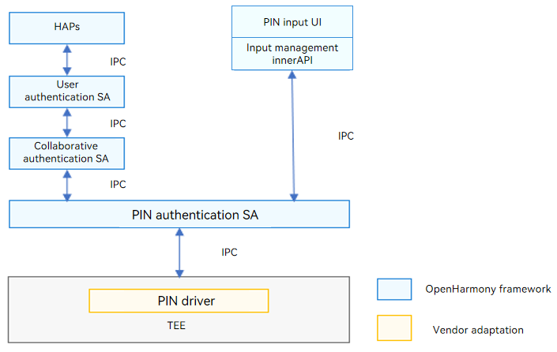

# PIN Authentication (pinauth)


## Introduction

The PIN authentication (pinauth) module supports password authentication and allows users to set and delete passwords. Working with the basic framework of the IAM subsystem, the pinauth module supports change of user passwords.

As the basic user authentication executor of OpenHarmony, pinauth registers resource information related to password authentication to the collaborative authentication framework based on the resource registration interface defined by collaborative authentication, and implements password setting, deletion, and authentication based on the scheduling of the collaborative authentication framework.

**Figure 1** pinauth architecture




User passwords are core assets in the system. The following security measures are taken in password authentication for security purposes:

- The password input user interface (currently including the password setting and password authentication dialog boxes) is provided by the system-level application (<sup>Note 1</sup>). The dialog boxes involved in user settings are provided by the setting application, and the password input dialog boxes involved in the screen unlock authentication are provided by the lock screen application.
- Password data transmission: The raw password data is not transmitted across devices. After a user password is entered in the password input dialog box, the raw password data entered is transmitted to the password authentication SA only after unidirectional processing in the input model management innerAPI.
- Secure storage and comparison of password data: The password authentication HDI defines the adaptation interfaces for device vendors. Device vendors can implement secure password comparison and storage in a TEE. <sup>Note 2</sup>

Note 1: To implement the password input dialog box, the application needs to register the password input dialog box with the password authentication SA through the input dialog box management API. The input box management API requires a high-level access permission and can be invoked only by system users.*

Note 2: The OpenHarmony framework provides pure software implementation of password authentication for developers to demonstrate the password authentication function. The pure software implementation does not include the secure storage capability.*

## Directory Structure

```undefined
//base/user_iam/pin_auth
├── frameworks		# Framework code
├── hdi			    # Definitions of APIs of device vendors for adaptation
├── interfaces		# Directory for storing external interfaces
│   └── innerkits	# Header files exposed to the internal subsystem
├── sa_profile		# Profile of the Service Ability
├── services		# Implementation of Service Ability services
├── unittest		# Directory for storing test code
├── bundle.json		# Component description file
└── pinauth.gni		# Build configuration
```


## Usage

### Available APIs

**Table 1** APIs for managing input dialogs

| API | Description                            |
| ------ | -------------------------------- |
| function registerInputer(inputer:IInputer) : boolean; | Registers the **inputer** callback with the password authentication Service Ability.  |
| function unregisterInputer():void;                    | Unregisters the **inputer** callback from the password authentication Service Ability.|

**Table 2** APIs for transferring data

| API| Description                      |
| ------ | -------------------------------- |
| onGetData : (callback:IInputData)=>void | Obtains the password data.|
| onSetData:(pinSubType:AuthSubType, data:Uint8Array)=>void | Transfers the password data from the password input dialog box to the password authentication Service Ability.|

### Usage Guidelines

- The APIs defined in the header file ```hdi\main\inc\pin_auth.h``` must be implemented in a secure environment. The password related information must be protected with the highest security level (TEE or security chip).

## Repositories Involved

[useriam_auth_executor_mgr](https://gitee.com/openharmony-sig/useriam_coauth)

[useriam_user_idm](https://gitee.com/openharmony-sig/useriam_useridm)

[useriam_user_auth](https://gitee.com/openharmony-sig/useriam_userauth)

**[useriam_pin_auth](https://gitee.com/openharmony-sig/useriam_pinauth)**

[useriam_faceauth](https://gitee.com/openharmony/useriam_faceauth)
